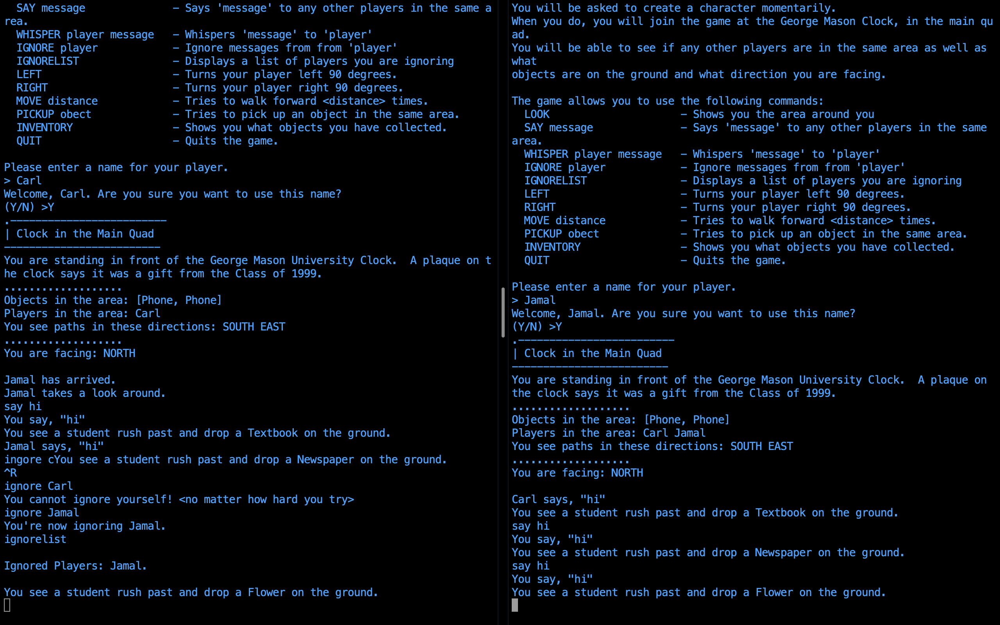

## Reply
### User:
> The reply command allows the user to quickly respond to the last whisper (message) they received. The command is executed by typing "REPLY" or "R", followed by a space, followed by the message to be sent. Reply only works once the user has successfully received a whisper.

Examples:

```
REPLY hello world!

R hello world!
```
### Dev:
> The reply command is handled in the switch statement in GameClient and follows a structure similar to the whisper command. The switch statement calls the quickReply(String srcName, String message) method in GameObject, which returns the quickReply(String srcName, String message) method in GameCore. The quickReply(String srcName, String message) method in GameCore calls the whisper(String srcName, String dstName, String message) method in GameCore with the dstName parameter set to the lastPlayer field of the srcName parameter. lastPlayer is stored in the Player class and is set in the whisper(String srcName, String dstName, String message) method in GameCore. GameObject and GameCore have accompanying interfaces for their respective methods.   

## Chat Log
### User:
> The chat log is an administrative functionality that stores all player communications in a text file (chatlog.txt) server-side. It allows an administrator to reference all whispers, replies, says, shouts, and jokes since the last launch of the game server. The records include the sender, the message, and the recipient(s).

See chatlog.jpeg for an example chat log.
### Dev:
> The chat log functionality is handled within the GameCore class. The constructor creates a PrintWriter object with a new file called chatlog.txt and closes the PrintWriter. Every time a message is logged, the chatlog.txt file is opened with a new PrintWriter object, written to, and closed. This process is handled within the chatLog(Player player, int chatType, String message, String target) method in GameCore and ensures that the file is updated properly while the game server is running. The chatLog(Player player, int chatType, String message, String target) method in GameCore is called in the say(String name, String message), whisper(String srcName, String dstName, String message), and shout(String name, String message) methods in GameCore.

## Ignore List

### Users:
> Use the ignore list command in order to view the players that you are currently ignoring. When you ignore a player their name will be added to this list and when you unignore a player, their name will be removed from this list. If a player's name is displayed in this list, you will not receive any messages from them via say, shout, whisper, or reply.  
Command: IgnoreList

### Developers:
> Ignore List will return a list of players that are currently being ignored. Each player has their own list (HashSet) of ignored players and that list is located in the player class.

>The only argument needed for this command to function properly is, the current players name so that the list of ignored players can be displayed. This list of ignored players is located in the Player class.



## Unignore

### Users:
> Use the unignore command to stop ignoring a player that you have previously ignored. After using this command, you will be able to receive messages from this player. If you are not ignoring the player, they can not be unignored.  
Command: Unignore [player to unignore]

### Developers:
> Unignore checks to see if the source or destination player is null and if you are trying to unignore yourself. If none of these conditions are true, then the unignore player method will be called from the player class. The unignore player method, will check to see if the ignore list contains that player. If it does, then that player is removed. If not, then the player will be notified that they can not unignore the other player.

>The argument needed for this command to function properly is, the name of the player doing the unignoring and the name of the player being unignored. Unignore is located within the player class.

## Shout

### Users:
> Use the shout command when you want to broadcast a message to all online players. This command differs from "say" in the way that players in different rooms can hear what you are saying. 
Command: Shout [message]

### Developers:
> After storing the message from the player that is shouting, this command iterates over a list of players that are currently online.  If the player in this list is online and is not currently ignoring you then a message will be broadcast to that player. The message is broadcast via getReplyWriter().

>The arguments needed for this command to function properly are, the shouting player's name and the message to be shouted.

