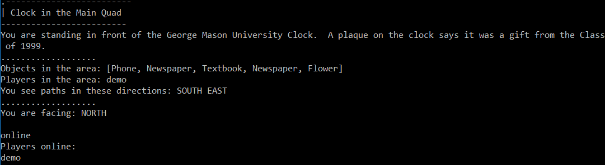
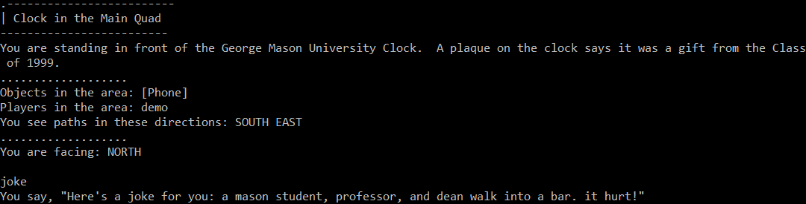
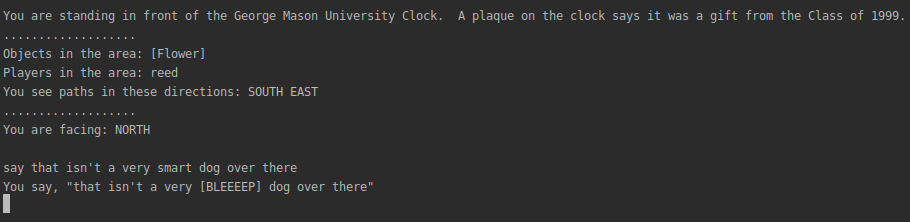

## Chat Log - Brandon
### User:
> The chat log is an administrative functionality that stores all player communications in a text file (chatlog.txt) server-side. It allows an administrator to reference all whispers, replies, says, shouts, and jokes since the last launch of the game server. The records include the sender, the message, and the recipient(s).

See chatlog.jpeg for an example chat log.
### Dev:
> The chat log functionality is handled within the GameCore class. The constructor creates a PrintWriter object with a new file called chatlog.txt and closes the PrintWriter. Every time a message is logged, the chatlog.txt file is opened with a new PrintWriter object, written to, and closed. This process is handled within the chatLog(Player player, int chatType, String message, String target) method in GameCore and ensures that the file is updated properly while the game server is running. The chatLog(Player player, int chatType, String message, String target) method in GameCore is called in the say(String name, String message), whisper(String srcName, String dstName, String message), and shout(String name, String message) methods in GameCore.

## Reply - Brandon
### User:
> The reply command allows the user to quickly respond to the last whisper (message) they received. The command is executed by typing "REPLY" or "R", followed by a space, followed by the message to be sent. Reply only works once the user has successfully received a whisper.

Examples:

```
REPLY hello world!

R hello world!
```
### Dev:
> The reply command is handled in the switch statement in GameClient and follows a structure similar to the whisper command. The switch statement calls the quickReply(String srcName, String message) method in GameObject, which returns the quickReply(String srcName, String message) method in GameCore. The quickReply(String srcName, String message) method in GameCore calls the whisper(String srcName, String dstName, String message) method in GameCore with the dstName parameter set to the lastPlayer field of the srcName parameter. lastPlayer is stored in the Player class and is set in the whisper(String srcName, String dstName, String message) method in GameCore. GameObject and GameCore have accompanying interfaces for their respective methods.  

## Player List
### User:
> The show players command allows the user to generate a list of players in the world who are currently online. The command is executed by typing "ONLINE," and then pressing the return key. Upon entering the command, the list of online players is generated on the user's screen, with one player name per line.

### Dev:
> The show players command is called from the GameCore.java file, using remoteGameInterface in the GameClient.java file. The code uses a StringBuilder object to generate the list of online players, appending a new line after each player name. It is called within the switch case for ONLINE within the GameClient.java file and access the PlayerList class within GameCore.java to access the name of each player. The method showPlayers() has no parameters, but the StringBuilder within the showPlayers() method can be edited by anyone to format the list of players in a better fashion (for example, alphabetizing or creating a more organized list), at the developer's discretion.



## Ignore

### Users:
> If a user wishes to ignore all messages from another player, they can do so via the "Ignore" command. Issuing the "Ignore" command, followed by another player's username, will block all messages sent to the user from that given other player. Other players will be notified that their messages to the ignoring user have been ignored.

### Developers:
> Ignore features work via a HashSet of Player class instance references (the Ignore list) the user has elected to ignore. The user gives the name of a player they wish to ignore via the Ignore command, and the system takes that String representing the name of the player the user wishes to ignore and uses it to get a reference to a Player instance from the GameCore. That reference is then inserted into a HashSet which is contained by the Player class instance associated with the user. The sender (Player instance) of each message recieved by the user is then checked against the Ignore List HashSet. If a match is found, the message is ignored. 


## Ignore List

### Users:
> Use the ignore list command in order to view the players that you are currently ignoring. When you ignore a player their name will be added to this list and when you unignore a player, their name will be removed from this list. If a player's name is displayed in this list, you will not receive any messages from them via say, shout, whisper, or reply.  
Command: IgnoreList

### Developers:
> Ignore List will return a list of players that are currently being ignored. Each player has their own list (HashSet) of ignored players and that list is located in the player class.

>The only argument needed for this command to function properly is, the current players name so that the list of ignored players can be displayed. This list of ignored players is located in the Player class.


## Unignore

### Users:
> Use the unignore command to stop ignoring a player that you have previously ignored. After using this command, you will be able to receive messages from this player. If you are not ignoring the player, they can not be unignored.  
Command: Unignore [player to unignore]

### Developers:
> Unignore checks to see if the source or destination player is null and if you are trying to unignore yourself. If none of these conditions are true, then the unignore player method will be called from the player class. The unignore player method, will check to see if the ignore list contains that player. If it does, then that player is removed. If not, then the player will be notified that they can not unignore the other player.

>The argument needed for this command to function properly is, the name of the player doing the unignoring and the name of the player being unignored. Unignore is located within the player class.

## Joke
### User:
> The joke command accesses a local text file stored in the user's game files (in this case, "jokes.txt") and randomly selects from it one of up to ten available jokes, separated by a new line. After selecting the joke, it then sends out a message to everyone in the room: "Here's a joke for you:" followed by the random joke selected. Due to the random nature of the command, the same joke can be told twice or more times using this command.

### Dev:
> The joke command is called from the GameCore.java file, using remoteGameInterface in the GameClient.java file. The code uses the File, ArrayList, Random, and Scanner objects in order to read in the text file of jokes. The file is read using the Scanner, and after each new line, the jokes are placed into an ArrayList<String> named joke. From there, the Scanner closes and the Random object randomly selects a joke from the ArrayList<String> joke. Finally, in the GameClient.java file, the method joke(String filename) is called through the RemoteGameInterface.say() method, using remoteGameInterface.joke("jokes.txt") as a parameter for the message to be said by the user inputting the joke command. This call to remoteGameInterface.say() is carried out in a switch statement case for "JOKE" within the GameClient.java switch statement.
  


## Shout

### Users:
> Use the shout command when you want to broadcast a message to all online players. This command differs from "say" in the way that players in different rooms can hear what you are saying. 
Command: Shout [message]

### Developers:
> After storing the message from the player that is shouting, this command iterates over a list of players that are currently online.  If the player in this list is online and is not currently ignoring you then a message will be broadcast to that player. The message is broadcast via getReplyWriter().

>The arguments needed for this command to function properly are, the shouting player's name and the message to be shouted.


## Word Filter
### User:
> The word filter is a list of words a given user has chosen to filter from their game's chat. In a file named "FilteredWords-[USERNAME].txt, users can enter a list of words (one per line) they wish to have filtered from chat. On every startup, the game will read these words from the file. From that point on, every time one of these words read from the file is detected in a chat scenario within the game, it will be replaced with "[BLEEEP]".

### Dev:
> Words are read from a file for each user by the GameClient class, and added to a HashSet of String objects contained within the Player class instance associated with that user. The user's player instance then parses each message (say, whisper, shout, etc) word by word. If one of the words in a message being parsed is found to also be contained in the Filtered Words Hashset, that word is replaced with a bleep string ("[BLEEEP]") in a new message that is presented to the user instead of the original. 
  


