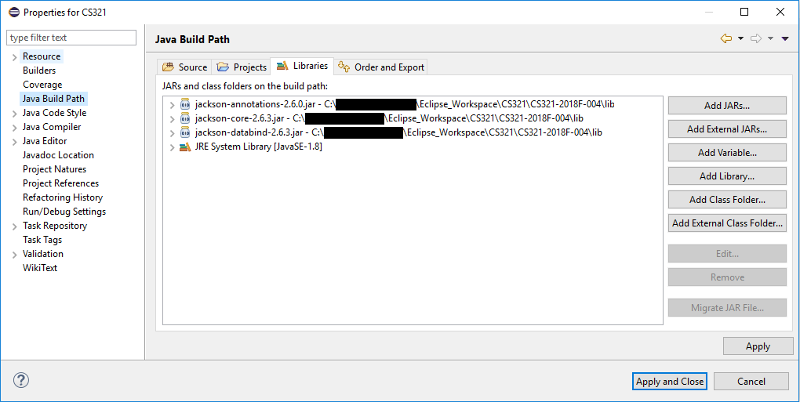
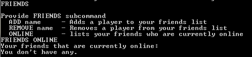
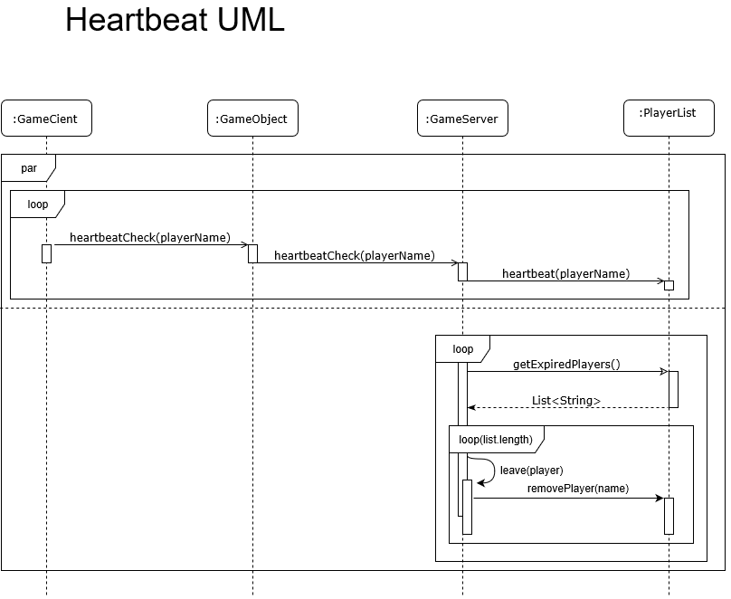
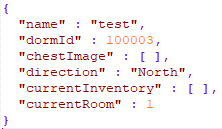

# Player Accounts(creating, deleting, storing, etc…)
--Will

## As a User

The user only needs to know two things. When the server starts create an account by entering 'C' at the prompt. From here you can create a username and password. This will create your persistent account. You can then log into the server any subsequent times using that information. All of your account elements such as player position and inventory should be saved.
The second is the DELETE command. Use this command when signed in to completely wipe away your profile forever.

## As a Developer

Player accounts are stored in files on a per-account basis. This is done so that accounts can be loaded and stored efficiently. The account data is simply the json serialization of the Player class. This was done so that changes to the player class in the future could be easily implemented by giving the marshaller getters/setters. Furthermore the password for the account is stored in a separate file instead of the Player class so that it does not sit in memory while the user is signed in.

###### Account hierarchy
```
/src
|-- players
|   |-- ac1
|   |   |-- data.json
|   |   |-- pass.txt
|   |
|   |-- ac2
|       |-- data.json
|       |-- pass.txt	   
```
###### Adding new fields to Player

The marshaller simply needs getters and setters for any new variables. Example:
```
private TYPE var;

public TYPE getVar() { 
	return this.var;
}

public void setVar(TYPE var) {
	this.var=var;
}
```
###### Primary file of interest: PlayerAccountManager.java

	public synchronized AccountResponse createNewAccount(String username, String password)
	private void writePlayerDataFile(Player p) throws Exception
	public void forceUpdateData(Player p)
	public boolean deleteAccount(String username)
	public AccountResponse getAccount(String username, String password)
	public boolean accountExists(String username)
	
These functions handle the management of all player account activities. Creating, Getting, Updating, and Deleting

###### Using IDEs

The json marshalling is handled by [Jackson](https://github.com/FasterXML) libraries. These files live in the `lib` folder. While classpath arguments have been added to the build and run command files, for an IDE to function correctly it will need to add these libraries.

In Eclipse,
Project -> Properties -> Java Build Path -> Libraries -> Add External JARs...

From here select the _3_ jar files.
It should look something like this:


# Friends (Adding, removing, storing, ect…)
--Ryan

## Users
The user can create a friends list by adding and removing users to their friends list with the "FRIENDS ADD [Name]" and "FRIENDS REMOVE [Name]" commands. They can also use the "FRIENDS ONLINE" command to see which of their friends are currently online. If the user needs to, they can use the "FRIENDS" command to view all currently implemented friend related subcommands.



## Developers
Friend information is stored in the format of two hashmaps, stored as friends you've added (which uses a key of your name, and a value of a hashtable containing the name of your friends), and friends who have added you (Which also has a key of your name and a value of a hashtable containing the name of people who have added your account as a friend). This is important as it allows the users friends list to automatically update to remove obsolete friends when they delete their account.

# Leave Game System (Logging out, remove from online, heartbeat)
--Quinten Holmes

## Users
After tireless hours of playing, it might finally be time to get some food. When ready to leave one only needs to type "QUIT".  If one is too tired to type "QUIT" they are able to click the 'X' button to close the console; however, they will not be able to log back in until the system officially recognizes they logged out. 

## Developers
When a player finally enters the "QUIT" command the game client will call 

###### Method
	public Player leave(String name) 
	
by the client’s GameObject which in turn will call the GameCore on the server.

Leave will find the player by the given name. Once the player is found, a message will be broadcasted to all players; notifying everyone the player has left the game. Once the message is broadcasted, the player is removed from the list of online users, logged, then forcibly saves the player’s data. 

A heartbeat protocol is being used to ensure a client is properly logged out in the event the client crashes or is forcibly closed.  The client sends a pulse every 2 seconds once the player logs-in. The server will call leave on any player that has not checked in within the past 30 seconds.  

The time the last pulse was received is stored in the PlayerList, which in turn can return the list of exired players upon request. The PlayerList will not remove any expired clients, leaving that task to the GameCore. 



# Join Game System (Logging in, list of online, loading files)
--Dylan

## Users
Once you have the game booted up, you will be given the option to log in or create an account. For logging in, you will need to have your username and password on hand and you’ll be able to join the game from wherever you were when you left. If you forgot your password, you would have created 3 recovery questions when first making your account. The game prompts a password reset if you get the username or password incorrect, if you accept and answer the questions correctly you’ll be able to reset your password. The answers are not case sensitive. 
	
## Devs
When a player joins a game, their username and password are passed along through the joinGame method in GameObject. There the password is hashed and the same method is called in the GameCore. If the player isn’t already online, then the getAccount method is called on the PlayerAccountManagaer, passing in the username and hashed password. The manager tries to retrieve the players account if it exists and there are no errors. Assuming all else goes well, the method will return the player account or a Response based on what caused the player account to be found. From there, if an account was found and retrieved, GameCore adds them to the active player list and the player is let into the game server. If not account data was found, the player is told that the username and password combination was invalid, allowing them to try again or reset their password. 

The GameCore keeps an iterable PlayerList of the currently online players at all times. As players join and leave, it gets updated. Within the class it uses a LinkedList to store the players, and supports adding, finding, and removing players from said list. 

The file loading regarding accounts is done in the PlayerAccountManagar, mainly in the getAccount method. Besides the password, player data is stored in json format while the password is stored hashed in a txt file. PlayerAccountManager utilizes the JsonMarshaller class to actually retrieve the data. 
	
Here’s an example of what a players json file will look like. 



