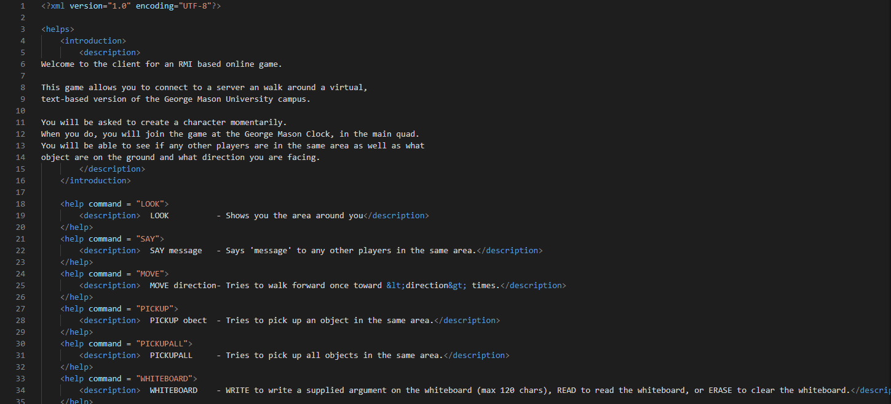

# CS321-2018F-004
## Player Movement(Adam Klingaman)

### Player Direction Overhaul:
#### For Devs:
Players no longer have a direction field. In order to move, they instead indicate a direction and move only 1 tile per command. Example: move north.  This command is case insensitive, and accepts NESW for directions as well as the names. Single letters for directions are handled by passing it to the valueOf() function inside of the direction enum, and handling converting those special cases to the Direction enum.  All calls to the player direction in both the client and the server have been removed, and are instead parsed from string into direction on the spot in gameClient and gameCore by grabbing the second token and passing it to the Direction enum valueOf() function, within the move case of the switch statement.
##### For Users:
You no longer have a direction. Simply move by saying move north. This is case insensitive, and you can use NESW for directions if you want. Check the image for an example.

## System Utilities(Patrick Veland)

### Help Command: 
Previously, the player was only shown the list of commands once at the time of their login or character creation. A “HELP” command has been added in order to provide the player with the opportunity to display what commands are possible within the confines of the game. The HELP command calls the showCommand() function which reads from an XML file containing every command possible. This was done so that if the command list changes or needs to be updated, a server reboot is not required, as all is required is an edit of the XML file. The XML file also contains the message that is displayed once a player has started running runClientLocal.sh. This message was taken out of the main code base for the same reason as the commands: so that if any edits to the message must be made, the server does not have to reboot. GameClient.java contains the code for opening and reading the XML file.

Part of the help.xml file which contains a  list of all commands as well as the introduction message

### Logging Functionality:
A DailyLogger class was created and added to the code base to serve the basic function of logging every user command that has been done on the server. This is so that if an error occurs, there is a clear log of what the player was doing right before their game crashed. The DailyLogger and its instantiation create a text file with the name “log (current date).” The log is set to track all user commands for the day, so if the server reboots on the same day it first booted, the log of user commands will go into the existing log. Currently, DailyLogger tracks user commands in the following fashion: “[timestamp] - [player name] used command [command] @ [location].” In the future, DailyLogger can track more server functions, but currently it only tracks the commands that users enter. The logs created by DailyLogger are stored in the /logs/ folder it creates.

Example log file showing basic commands as well as login, logout, and server boot information

## Player commands(Isaac Ryou)

### Custom commands:

#### For developer:

Custom command functionality has been added to the game. The goal of this functionality is to allow users bind command to the custom command they are willing to use and use custom command instead of already existing command. All changes for custom command has been made on GameClient.java file. Four methods has been added to GameClient.java, addCustomCommand, executeCustomCommand, removeCustomCommand, and showCustomCommands. When a player adds their first custom command, new xml file named CommandShortcut.xml is going to be created. This xml file stores every custom command player has configured as well as the command binded to the custom command and will later be used by newly added methods to add, execute, remove, or view custom command. It is possible to add CommandShortcut instead of letting the game to create one, and this way player can have pre-configured custom commands. It is also possible for players to provide argument with custom command. This means that if player binds ‘move’ command to ‘m’ and enter ‘m n’, the game will automatically recognize this as ‘move n’ which moves player character to north direction.

#### For Users:

Custom command has been added to the game. Custom command allows players to bind command to the custom command they are willing to, which can be used for a shortcut command or easier to remember command name. Players can add custom command to game by using “ADDCOMMAND commandName” command where “commandName” is the custom command player is willing to use. After that, the game will ask player to enter the command to bind to custom command. Player can provide command with argument or not. For instance, binding “move n” and “move” are both allowed. After binding the command, player can use custom command just like other commands. It is also possible to provide argument when entering custom command. Player can also view custom commands they have configured using “CUSTOMHELP” command and remove custom command by using “REMOVECOMMAND” command. When “REMOVECOMMAND” command gets used, the list of currently configured custom command will automatically appear, so a player does not have to memorize or use

“CUSTOMHELP” command when they wish to remove command they have configured in the past.

### Redo and help command:

#### For developers:

Redo command has been added to the game. Redo command allows players to perform exactly the same action they performed prior to using redo command. For instance, if player enters command “move n” and performs redo, the game will automatically perform “move n” once again. Changes for redo command has been done in GameClient.java. Specifically, lastCommand string variable has been added and whenever a command that is not redo enters, it will be saved in the lastCommand variable. Then, when redo command gets entered, whatever that was stored in the lastCommand will be used for next action.

In addition to the redo command, help command has been added as well. By entering help, players will be able to view available commands. Player should be able to use help command without the limitation of time or place. Changes for help command can be found in GameClient.java.

#### For users:

Redo command has been added to the game. Redo command allows players to perform exactly the same action they performed prior to using redo command. You can now enter redo instead of entering entire command you just entered if you wish to perform the same action again. For instance, if you wish to move north after entering “move n”, all you have to do is simply enter redo. Any command that is not redo will be stored for redo command. There is no auto correct for redo command, so please note that entering invalid command and entering redo command does not automatically fix the invalid command.

In addition to the redo command, help command has been added as well. Players are now able to use help command to view the list of commands available to them regardless of time and place.

## World Interactions(David Keith)

### PickupAll command

A PICKUPALL command has been added to pickup all objects in the current room. This command is case insensitive and will remove all objects from the room and add them to the player’s inventory. This command is a separate command from the PICKUP command.

#### Developer Documentation

In adding the PICKUPALL command the following files have been modified: GameClient.java, GameCore.java, GameObject.java, GameObjectInterface.java, and Room.java.

A pickupall RMI call has been added.

* public String pickupAll(String name) throws RemoteException

#### PickupAll command syntax

* PICKUPALL   - Will pickup all items in player’s current room

### Whiteboard

A whiteboard has been added to the game. Each room has its own whiteboard and players can read, write and erase text from the whiteboard. The whiteboard has a maximum capacity of 120 characters and attempts to write more than this on the whiteboard will fail without adding any text to the whiteboard in that room. Each of the whiteboard commands is case insensitive.

The purpose of the whiteboard is to allow players to interact with each other without being in the same room at the same time. When a player interacts with the whiteboard other players in the same room are notified about this interaction in order to encourage player interaction.

### Developer Documentation

Whiteboard related code has been added to GameClient.java, GameCore.java, GameObject.java, GameObjectInterface.java, and Room.java. There are three RMI calls related to the whiteboard functionality.

* public String whiteboardErase(String name) public throws RemoteException

* public String whiteboardRead(String name) throws RemoteException

* public String whiteboardWrite(String name, String text) throws RemoteException

### Whiteboard Command Syntax

The three whiteboard commands are:

* WHITEBOARD READ           - Prints the text currently on the room’s whiteboard

* WHITEBOARD WRITE (text) - Writes text argument to the room’s whiteboard up to a cap of 120 characters

* WHITEBOARD ERASE          - Clears text from the room’s whiteboard

### Example Interaction with whiteboard

## General Fixes(Kamuran Keyimu)

There are fixes that are made to the code base to improve the experience of the developers and the users.There are two fixes, one more important than the other. Including fixing typo and fixing invalid input crash.

### Help command if wrong input and typo fixes

The help command fixes the most important error which was whenever a wrong value is entered, the game crashes. It fixes it and gives the command for help command which prints all the commands. The typo fix is minor but still improves the experience for the players. The fix is done simply by adding a default case for the main switcher statement.

