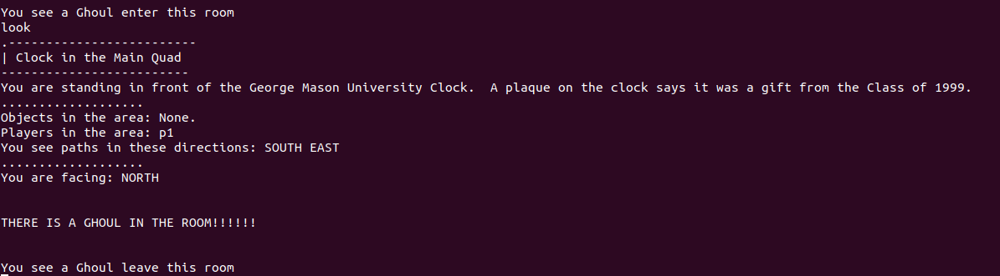
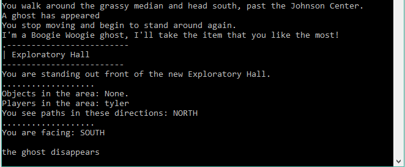
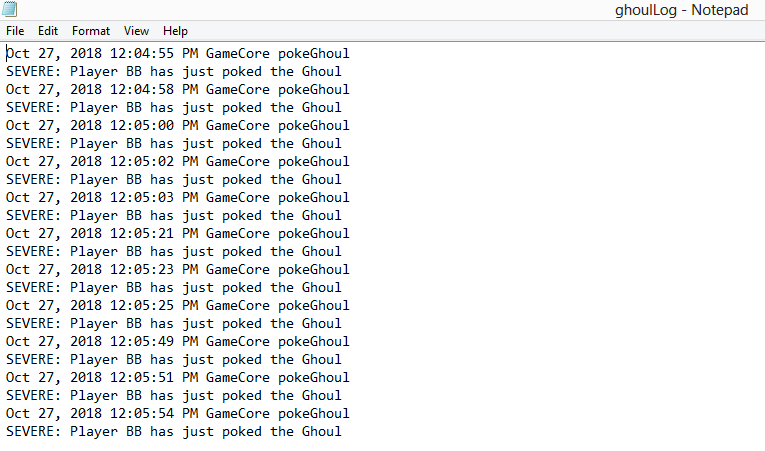
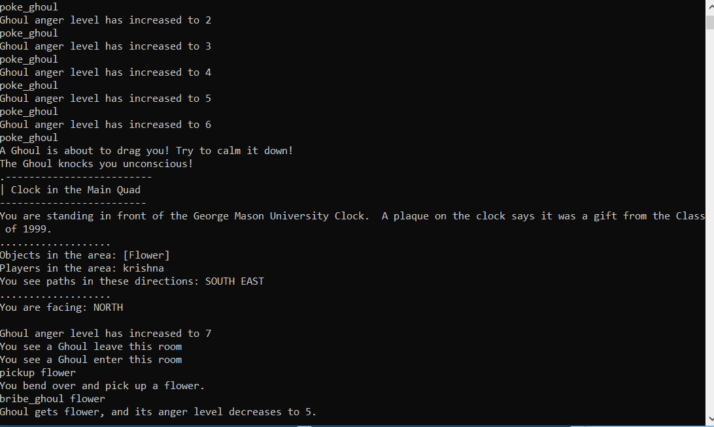

# Ghoul thread/wandering  

## Ghoul guide for players  

**Ghoul, stood on the Land**  
One Ghoul will be summoned when the world(gameclient) built. The Ghoul is an human-like but ignorant creature. So it will wander on the land randomly.  
**Ghoul, wander on the Land**  
Technically, the Ghoul always spend 10-15s to move from one room to another room. The Ghoul cannot fly, it can only walk on the ground. Thus, the Ghoul always move to neighboring rooms.  
**Ghoul, witness by the players**  
If the Ghoul stay in some room, any players can get an message *"THERE IS A GHOUL IN THE ROOM!!!!!!"* when they enter this room or use command `LOOK` in this room.  
In another case, if the Ghoul try to enter/leave some room, all players in this room can also get an message *"You see a Ghoul enter/leave this room"*.  

*the following picture show what happened when the Ghoul enter/leave the room, and player try to look them when they stay in room*

## Ghoul guide for developers
**Class relevant to Ghoul**  
The following Class are relevent to this feature:  
`Ghoul, GameCore`  

**Class Ghoul**  
This Class is express a ghoul. It is a new class writen by us.
 - **Constructor Summary**
   - `Ghoul(int room)` Create a Ghoul in the given room.  
 - **Method Summary**
   - `getAngryLevel():int` get the Angrylevel of this Ghoul  
   - `getRoom():int` get the current room of this Ghoul  
   - `setRoom(int room):void` set the current room of this Ghoul
   - `modifyAngryLevel(int amount):void` add **amount** of value to this Ghoul's Angrylevel  
  - `Drag(Player p):void` Drag player **p**  

**Class GameCore**  
This class already exist in the origin src code. We modified it. 
 - **Changed in Constructor**
   - `GameCore()` We add a new Thread called `awakeDayGhoul`, this thread will create one Ghoul on the random room and control it wander randomly, utill the game server shutdown. 
 - **Changed in Methods**
   - `look(String playerName):String` Now it will also return the message including the information about the Ghoul. 
 - **New Methods**
    - `ghoulWander(Ghoul g, Room room):void` Ghoul **g** in room **room** will try to move to another neighboring room

# Ghosts

## Ghost Guide for Players

When a player moves to a new room, there is a small chance that a ghost will appear in that room. If a ghost appears, it will say something spooky/funny, then quickly disappear from the room.

*The following picture shows what happens when a ghost appears in a room you enter.*

## Ghost Guide for Developers

Two classes were modified for the implementation of ghosts in this game. They are Ghost.java and GameCore.java.

### Ghost.java
This class contains almost all of the code for ghosts. It implements the Thread interface and has the following three methods: Ghost(Player p), run(), and loadSayings().
##### Ghost(Player p)
This is the constructor, which just ininitalizes the class variables and calls loadSayings().
##### run()
This overrides the Thread interface. In this method, we have a random chance of spawning a ghost, pick a random saying from the arraylist of sayings, and write the saying to the game.
##### loadSayings()
Ths reads in a text file called "ghost_sayings.txt", and stores each line of the file as a possible saying in ArrayList<String> sayings.

### GameCore.java
The only modification made to GameCore.java is in the public String move() method, in which a Ghost is initialized and its run method is started.

# Log of the ghoul interactions
A text file of ghoul interactions will be created when a player interacts with a ghoul.

## For Developers
-	 GhoulLog.java can be found in the src folder. It comprises GhoulLog class. GhoulLog class has a constructor that creates a ghoulLog.txt file if it doesn't already exist. Within the constructor a FileHandler object is created with a purpose of writing to a specified file. A Logger object is also created within the constructor in order to log messages for this purpose. The newly created logger instance then calls addHandler method on a newly created FileHandler object to receive logging messages. A SimpleFormatter object is also created so that FileHandler instance can call setFormatter method, with that SimpleFormatter instance as an argument.

-  The class GhoulLog also contains a single method called glLog of the void type that accepts three String arguments(class, method, message) respectively so that the class, method from which glLog() was called and the desirable message could be displayed in the log. The body of the glLog contains a single logger call to the logp method of the class Logger. logp method has four parameters: 

-level - One of the message level identifiers e.g. SEVERE

-sourceClass - name of class that issued the logging request

-sourceMethod - name of method that issued the logging request

-msg - The string message 
 
- The method will be called from the GameCore class, within the method poke_ghoul. The message level identifiers will be SEVERE. The message that will be displayed in the log: "Player" + " " + playerName + " has just poked the Ghoul". 

# Ghoul's anger level:
The Ghoul has an anger level (starting at 0, the lowest), 
which is altered through the user's interactions with the ghoul.
The inclusion of the anger level enriches gameplay due to adding
interactions with NPCs.
#### Poking the Ghoul:
An action a player can do by calling the 'poke_ghoul' input. 
When called, if the ghoul is in the room, its anger level goes up by one, 
and it will say a statement giving the user an idea of how angry it is.
#### Giving an item to the Ghoul:
A player can give an item to the ghoul, using the 'bribe_ghoul (item name)' input. 
If the item you are planning to give is in your inventory, 
then the ghoul's anger level will go down and you get a message saying so.
If the ghoul's anger level is at 
#### Ghoul's Dragging Ability:
When the ghoul's anger level is poked to above 7, 
the ghoul will knock the player who poked it unconscious, 
then drag them to the clock tower. 
Then, it will proceed to take a random item
from the player's inventory, and lowers its anger by 1.

Example from in game: 

## Contributors
#### Ghoul Thread/Wandering - YuQiao
#### Ghosts - Tyler
#### Ghoul Logging - Aleksa
#### Ghoul Anger - Krishna
