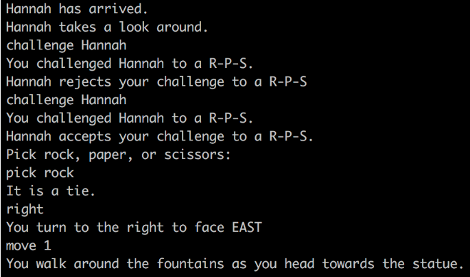
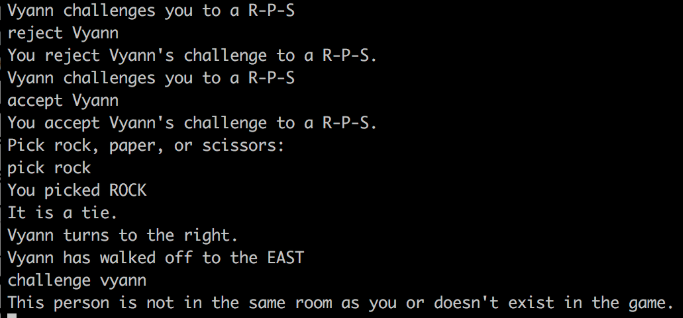
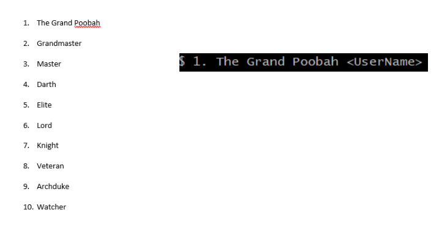
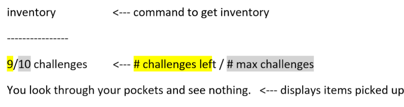
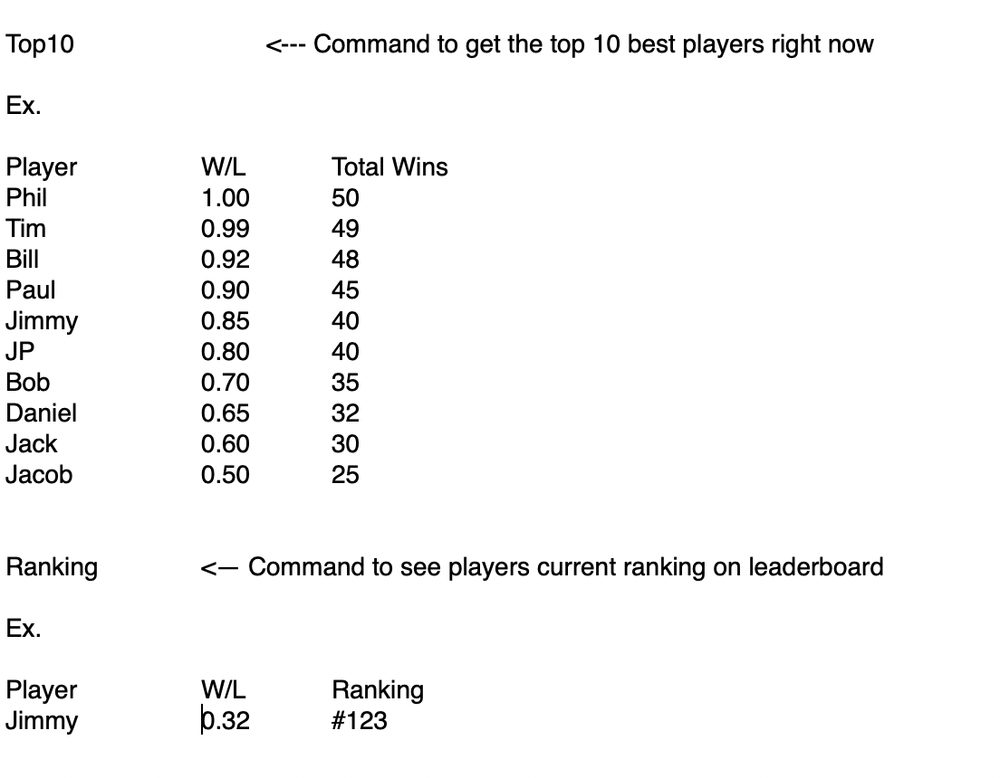

# PvP Rock Paper Scissors Battles

### Playing R-P-S - Vyann:
#### As a User:
After users have enter into a game, users can see a list of commands. To play rock, paper, scissors with someone, use the commands listed here:
* Challenge <enter_player_name>
* Accept <enter_player_name>
* Reject <enter_player_name>
* Pick <enter_rock_paper_scissors>

One important note is that when you want to challenge someone to a rock, paper, scissors, you both need to be in the same room or else it would return a message saying that the person you challenged is not in the same room as you. Another note is that when using command "pick", the only option users can enter is rock, paper, or scissors. The basic R-P-S rules applies to this game, which means rock beats scissors, scissors beats paper, and paper beats rock. Here is an example of Vyann challenging Hannah to rock, paper, scissors:

#### As a Developer:
When the user enter the command "challenge", "accept", "reject", or "pick", the following methods in GameObject are being call on the client's side:
* public String challenge(String challenger, String challengee)
* public String accept(String challenger, String challengee)
* public String reject(String challenger, String challengee)
* public String pick(String challenger, String challengee)
These methods will then go to the server side in GameCore. The functionality of each method listed above are almost the same. When the "challenge", "accept", "reject", or "pick" is being called, it will check for three things. It will check if:
1. All players are in the game
2. Challenger is in the same room as challengee
3. Challenger or challengee are already in a R-P-S battle

If any of the above applies, return a message telling why users are not able to challenge someone to a R-P-S. Otherwise, returns a message saying that someone has challenged them to a R-P-S battle, accepted their challenge or rejected their challenge. 
As for the "pick" method, it checks what input the user enter. If the input is not rock, paper, scissors, return a message saying it is an invalid option. If it is a valid option, it will then compare the challenger's option to the opponent's option. Then it will compare the option and return a message to both users saying who won.

### Ranking System - Ahmed:
#### For Users:
Each player in the game will be given a ranking based on their R-P-S battles. The rankings will be determined based on their users R-P-S score. You will be able to see the top 10 players in the world and their respective rankings as well as your own. Each player will be given a title based on their ranking. The players will be allowed to receive a list of all the other players in the world along with their respective title and rankings. The list of commands that will trigger the activation of the top 10 ranking and the list of all the players are:
* top10
* rank <player_name>
* listAllPlayers

Player ranking will continuously update after every R-P-S battle to ensure accuracy in their respective ranking and title. All players who aren't in the top 10 will have the title of "Casual", the list of the top 10 titles are the following:

#### For Developers:
The commands "top10", "rank", and "listAllPlayers" will come from the GameObject file in their respective methods. The methods will relay the information about the players to the GameCore file that will produce the information about the players to the GameCore file that will produce the information the player is asking. The calculation for each players R-P-S score will use the following formula: **(win/(1+loss) x totalGames)**. The results of every R-P-S will be stored in a log file in order to calculate players R-P-S scores. This way to ensure someone who only played and won a single game of R-P-S doesn't receive the first place title against someone who has played and won more games. The rankings of the top 10 will be shown even if the users are offline. 

### Items, Player Inventory(Using R-P-S) - Hannah
#### For Users:
Challenges are items that can be used to start a R-P-S battle. Players can have up to 10 challenges at a time. 1 challenge is restored automatically every five minutes. Challenges will only be deducted from the player's inventory if the challengee accepts the challenge. When a player enters the command "inventory" the following will be shown:

The number of challenges left will be displayed as a fraction over 10. The rest of the items will be displayed below.

#### For Developers:
The command "inventory" calls the following method from GameObject on the client's side: public String inventory(String name). The method will go to the server's side and call the inventory method in GameCore. The inventory information will be stored separately as a linked list (for items picked up) and a number (for the number of challenges left) in Player. The inventory method in GameCore will get the information from Player and print it to the player's screen. For the challenge method in GameCore, it will check if a player has any challenges left before allowing them to challenge another player. If there are no challenges left the player will be unable to challenge.

### Files Related to R-P-S - Jimmy:
#### For Users:
The user should know nothing about the files related to the game, but the Users interactions with files related to R-P-S include the files required to run the R-P-S battles but also the ranking system. The user will be able to get his own ranking to see how well he is doing compared to other R-P-S players as well as the best top 10 players to see who is winning the most right now.

#### For Developers:
When the users enter commands such as “challenge”, “accept”, “reject”, “teach”, and “pick” are entered GameClient.java processes the perspective methods and checks to see for certain conditions from Player.java are set such as being able to accept only one challenge at a time. the methods from GameObjects.java are called from the client side and then from there the method will go to the server side and call the perspective methods from GameCore.java. Depending on the following methods, Player.java will be checked for attributes it holds to see if those commands are valid. Then from there GameCore.java will print information based on the command given. This is how all the files GameCore.java, GameObject.java, GameClient.java, and Player.java all work together to run R-P-S. The other files involved in R-P-S will include the recording files that include a record of all the R-P-S battles to see if there is any issues. This also includes ranking the R-P-S battles.

“Challenge” must check to see if the player is in the game to be able to be challenged.
“Accept” must check if that player exists and if they have challenged you from Player, as well as if Player has already accepted a challenge.
“Reject” must check to see if a player has a challenge first that is not accepted yet.
“Teach” must check to see if the player is in room 1 to see if the teacher is available.
“Pick” must check to see if player is in a current challenge to pick one of the options in R-P-S, it must be a valid selection for the game.
