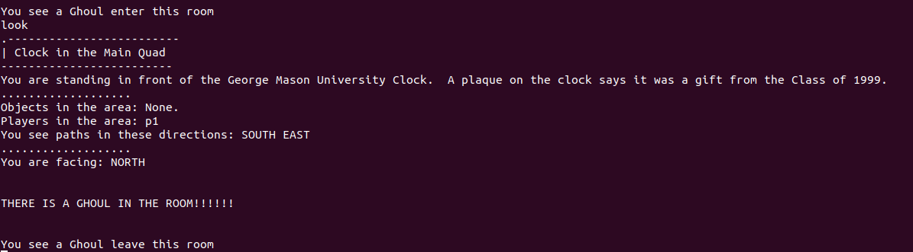

## Ghoul thread/wandering  

### Ghoul guide for players  

**Ghoul, stood on the Land**  
One Ghoul will be summoned when the world(gameclient) built. The Ghoul is an human-like but ignorant creature. So it will wander on the land randomly.  
**Ghoul, wander on the Land**  
Technically, the Ghoul always spend 10-15s to move from one room to another room. The Ghoul cannot fly, it can only walk on the ground. Thus, the Ghoul always move to neighboring rooms.  
**Ghoul, witness by the players**  
If the Ghoul stay in some room, any players can get an message *"THERE IS A GHOUL IN THE ROOM!!!!!!"* when they enter this room or use command `LOOK` in this room.  
In another case, if the Ghoul try to enter/leave some room, all players in this room can also get an message *"You see a Ghoul enter/leave this room"*.  

*the following picture show what happened when the Ghoul enter/leave the room, and player try to look them when they stay in room*

### Ghoul guide for developers
**Class relevant to Ghoul**  
The following Class are relevent to this feature:  
`Ghoul, GameCore`  

**Class Ghoul**  
This Class is express a ghoul. It is a new class writen by us.
 - **Constructor Summary**
   - `Ghoul(int room)` Create a Ghoul in the given room.  
 - **Method Summary**
   - `getAngryLevel():int` get the Angrylevel of this Ghoul  
   - `getRoom():int` get the current room of this Ghoul  
   - `setRoom(int room):void` set the current room of this Ghoul
   - `modifyAngryLevel(int amount):void` add **amount** of value to this Ghoul's Angrylevel  
  - `Drag(Player p):void` Drag player **p**  

**Class GameCore**  
This class already exist in the origin src code. We modified it. 
 - **Changed in Constructor**
   - `GameCore()` We add a new Thread called `awakeDayGhoul`, this thread will create one Ghoul on the random room and control it wander randomly, utill the game server shutdown. 
 - **Changed in Methods**
   - `look(String playerName):String` Now it will also return the message including the information about the Ghoul. 
 - **New Methods**
    - `ghoulWander(Ghoul g, Room room):void` Ghoul **g** in room **room** will try to move to another neighboring room

